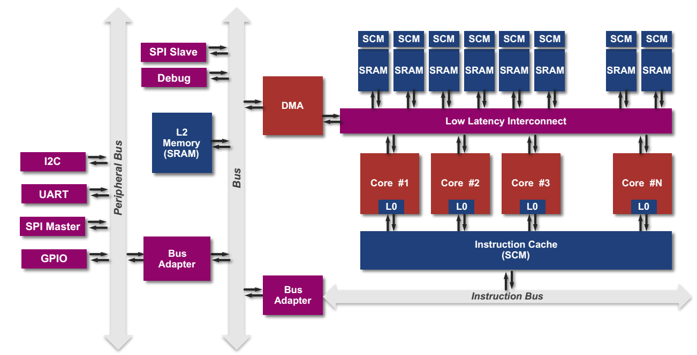

## 8.1 PULP介绍
### 8.1.1 项目背景
PULP（Parallel Ultra-Low Power）项目由瑞士苏黎世联邦理工大学（ETH Zürich）的综合系统实验室（IIS：Integrated Systems laboratory）和意大利博洛尼亚大学（University of Bologna）的高能效嵌入式研究组（EEES：Energy-efficient Embedded Systems）联合设计研发，目的是实现一个开放、可扩展的SoC，并且总体功耗在mW级，能效达到pJ/op[1]。 
 
该项目的现实意义在于满足IoT（Internet of Thing）设备对计算能力的需求，当前，IoT设备的数量与日俱增，具有的功能也越来越多，可以获取周边的图像、环境参数等大量数据，进行如人脸识别等应用，但是这需要大量的计算能力，当前的IoT设备无法满足该需求，只能将数据通过无线的模式发送到计算平台进行集中计算，但是通信又需要消耗大量的能量，对于靠电池供电的IoT设备而言，这样做无疑降低了其使用寿命。为了解决上述问题，出现了特定应用加速器，应用在IoT设备上作为扩展，既降低了功耗，又实现了高的计算能力，但是这种方式的缺点就是缺乏灵活性，特定应用加速器是某一种特定运算的ASIC，功能有限，PULP弥补了这条鸿沟，其通过架构的优化设计，实现了既拥有强大的计算能力，又满足IoT设备低功耗需求，同时还具有通用处理器的灵活性。
### 8.1.2 架构介绍
其架构设计如图8-1所示。 
 
 
图8-1 PULP架构设计[2]  
从图8-1的右半边可以发现PULP是一个多核SoC，其处理器核目前有两种，一种是采用OpenRISC指令集的OR10N，另一种是采用RISC-V指令集的RI5CY。除了多核设计，为了实现低功耗、高性能的目的，PULP还采用了如下一些优化设计：  
（1）指令集扩展：PULP扩展了原有的指令集，使得其支持以下特性（详细内容会在本章后续部分依次介绍）。 
* 算术指令扩展（ALU Extension）
* 硬件循环（Hardware Loop）
* 地址自增的访存指令（post-incrementing Load & Strore Instruciton）
* 乘累加指令（Multiply-Accumulate）
* 向量操作（Vectorial）
（2）共享指令缓存：多个处理器核共享一个L1指令缓存，避免了为了维护缓存一致性带来的复杂性，而且采用的是SCM（Standard Cell based Memories），可以在更低的电压下工作，从而进一步降低了功耗。 
 
（3）指令预取Buffer：共享的指令缓存可能会由于多个处理器核同时访问，而增加延迟，为此，为每个处理器设计了一个指令预取Buffer，该Buffer的大小一般是指令缓存line的大小，比如128bit。同时，对于RISC-V指令集而言，该指令预取Buffer还实现了16bit压缩指令扩展为32bit。  
（4）紧耦合数据缓存：使用的是Scratchpad Memroy，分为多个bank，一般为8KB，每个bank还对应一个SCM，一般为1KB。  
经过上述优化，可以大幅提高能效，在28nm工艺下，工作电压可以低至0.46V，功耗1mW，此时仍然有比较好的性能表现，主频40MHz，0.2GOPS[3]。
### 8.1.3 流片情况
PULP在研发过程中，已多次流片，如表8-1所示。  
表8-1 PULP流片情况 
<table>
<tr>
	<td>名称</td>
	<td>工艺</td>
	<td>工艺</td>
	<td>主频</td>
	<td>时间</td>
	<td>备注</td>	
</tr>
<tr>
	<td>Manny</td>
	<td>180nm</td>
	<td>3 W @0.6V 1.5MHz</td>
	<td>1.25 MHz</td>
	<td>2015年</td>
	<td>四核, 64 kB二级缓存16KB紧耦合数据缓存，4KB指令缓存</td>	
</tr>
<tr>
	<td>Diego</td>
	<td>180nm</td>
	<td>3 W @0.8V 15 MHz</td>
	<td>15 MHz</td>
	<td>2015年</td>
	<td>同上</td>	
</tr>
<tr>
	<td>Sid</td>
	<td>180nm</td>
	<td>3 W @1.0V 15 MHz</td>
	<td>15 MHz</td>
	<td>2015年</td>
	<td>同上</td>	
</tr>
<tr>
	<td>Vivosoc</td>
	<td>130nm</td>
	<td>45 mW @1.2V 40MHz</td>
	<td>140 MHz</td>
	<td>2015年</td>
	<td>用于生物医学信号采集，可穿戴设备上，双核</td>	
</tr>
<tr>
	<td>Vivosoc2</td>
	<td>130nm</td>
	<td>20 mW @1.2V 50MHz</td>
	<td>64 MHz</td>
	<td>2016年</td>
	<td>同上，但是是四核</td>	
</tr>
<tr>
	<td>Vivosoc2.001</td>
	<td>130nm</td>
	<td>20 mW @1.2V 50MHz</td>
	<td>64 MHz</td>
	<td>2016年</td>
	<td>同上，但是是四核</td>	
</tr>
<tr>
	<td>Mia_Wallace</td>
	<td>65nm</td>
	<td>1 mW @1.2V 1MHz</td>
	<td>400 MHz</td>
	<td>2015年</td>
	<td>四核，其中有一个卷积码加速器</td>	
</tr>
<tr>
	<td>Fulmine</td>
	<td>65nm</td>
	<td>13 mW @ 0.8 V, 104 MHz</td>
	<td>400 MHz</td>
	<td>2015年</td>
	<td>Mia_Wallace的改进型，增加了一个密码加速器</td>	
</tr>
<tr>
	<td>Artemis</td>
	<td>65nm</td>
	<td>1 mW @1.2V 1MHz</td>
	<td>500 MHz</td>
	<td>2014年</td>
	<td>四核，每个处理器核增加了一个FPU</td>	
</tr>
<tr>
	<td>Hecate</td>
	<td>65nm</td>
	<td>1 mW @1.2V 1MHz</td>
	<td>500 MHz</td>
	<td>2014年</td>
	<td>四核，共享两个FPU</td>	
</tr>
<tr>
	<td>Diana</td>
	<td>65nm</td>
	<td>1 mW @1.2V 1MHz</td>
	<td>500 MHz</td>
	<td>2014年</td>
	<td>四核，1个标准FPU，3个裁剪的FPU</td>	
</tr>
<tr>
	<td>Phoebe</td>
	<td>65nm</td>
	<td>22 mW @1.2V 100MHz</td>
	<td>500 MHz</td>
	<td>2015年</td>
	<td>Selene的改进版</td>	
</tr>
<tr>
	<td>Pulp</td>
	<td>28nm</td>
	<td>8 mW @0.7V 10MHz</td>
	<td>475 MHz</td>
	<td>2013年</td>
	<td>四核</td>	
</tr>
<tr>
	<td>Pulpv2</td>
	<td>28nm</td>
	<td></td>
	<td>1000 MHz</td>
	<td>2014年</td>
	<td>四核</td>	
</tr>
<tr>
	<td>Pulpv3</td>
	<td>28nm</td>
	<td>1.2 mW @ 0.6V, 50MHz</td>
	<td>66 MHz</td>
	<td>2015年</td>
	<td>同上，集成了一个卷积运算加速器</td>	
</tr>
<tr>
	<td>Honey_Bunny</td>
	<td>28nm</td>
	<td>1 mW @1.2V 1MHz</td>
	<td>60 MHz</td>
	<td>2015年</td>
	<td>第一个使用RI5CY作为处理器核的PULP</td>	
</tr>
</table>

## 参考文献
[1]PULP - An Open Parallel Ultra-Low-Power Processing-Platform, http://iis-projects.ee.ethz.ch/index.php/PULP,2017-8 
[2]Florian Zaruba, Updates on PULPino, The 5th RISC-V Workshop, 2016. 
[3]Michael Gautschi,etc,Near-Threshold RISC-V Core With DSP Extensions for Scalable IoT Endpoint Devices, IEEE Transactions on Very Large Scale Integration Systems 
[4]Andreas Traber, Michael Gautschi,PULPino: Datasheet,2016.11 
[5]http://www.pulp-platform.org/ 