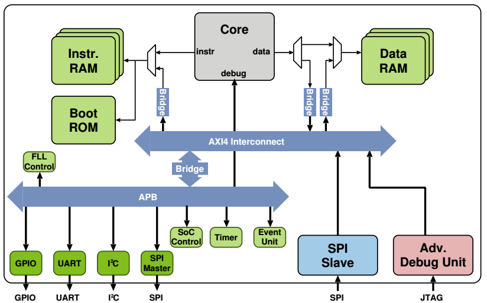
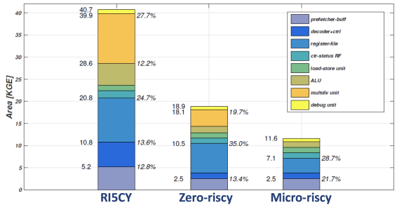

## 8.2 PULPino介绍
### 8.2.1 PULPino与PULP的关系
PULPino是PULP的简化版本，如图8-2所示。 
 
图8-2 PULPino架构是PULP架构的简化版[2]  
对比图8-1PULP架构设计可知PULPino相比PULP在如下几个方面做了简化： 
（1）多核变为单核； 
（2）指令RAM、数据RAM都不再需要支持多核； 
（3）去掉了二级缓存； 
（4）去掉了DMA。 
此外还有一个变化：源代码于2016年3月1日开源，采用 Solderpad license，使用的编程语言是System Verilog，PULPino支持处理器核是采用OpenRISC指令集的OR10N，但是在目前的开源版本中只支持RISC-V指令集。 
图8-3是PULPino的发展路线图，从中可知，开源PULPino的最终目标还是为了开源PULP，从易到难，便于用户接受，预计在2018年将开源PULP。 
 
图8-3 PULPino的发展路线图  

### 8.2.2 PULPino的结构
相较图8-2而言，图8-4更加具体、完整的显示了PULPino的结构。 
 
图8-4 PULPino的结构[4]  
从图中可以发现PULPino有如下一些特点： 
（1）采用的是指令RAM、数据RAM分开的哈佛结构； 
（2）增加了一个Boot ROM，其中可以存储启动代码，利用该启动代码可以加载连接至SPI接口的Flash中的程序。 
（3）采用的AXI4、APB两级总线结构。 
（4）具有外设接口，包括GPIO、UART、I2C、SPI等。 
（5）含有一个SoC Controll模块，其作用是整个SoC平台的控制信息，包括：是否使能时钟门、设置启动地址、架构信息等。 
（6）提供了一个Advanced Debug Unit，提供了标准调试JTAG接口，使得调试器可以访问指令RAM、数据RAM、处理器内部寄存器，以及外设对应的控制寄存器等。 
（7）提供了一个SPI Slave接口，直接连接在AXI互连总线上，可以通过该接口在不影响处理器的情况下，访问指令RAM、数据RAM、处理器内部寄存器，以及外设对应的控制寄存器等。 
图8-2中各模块的详细功能、寄存器作用可以参考文献[4]。 

### 8.2.3 处理器核
PULPino目前支持4种不同配置的、采用RISC-V指令集的处理器核，如下： 
（1）RI5CY：这是最早开源的处理器核，支持RV32-ICM，并且支持算术指令扩展（ALU Extension）、硬件循环（Hardware Loop）、地址自增的访存指令（post-incrementing Load & Strore Instruciton）、乘累加指令（Multiply-Accumulate）、向量操作（Vectorial）等扩展。 
（2）RI5CY+FPU：包括RI5CY，以及一个符合IEEE-754标准的单精度FPU。 
（3）Zero-riscy：支持RV32-ICM，在占用资源上做了优化。 
（4）Micro-riscy: 这是4种配置中占用资源最少的，支持RV32-EC，具有16个寄存器，且不支持硬件乘法。 
不同配置的资源占用情况如图8-5所示。Micro-riscy的资源占用是RI5CY的接近1/4。  
 
图8-5 不同配置的资源占用情况[5]  
图8-6是不同配置在不同应用环境中的能耗情况。从图中可以发现，不同的配置适合于不同的应用场景，如果用于数字信号处理领域，有比较多的卷积运算，那么RI5CY的能耗是最低的，因为它做了指令扩展，内部有专用硬件用于实现卷积运算。如果用于控制领域，那么Micro-riscy的能耗最低。所以，用户需要依据不同的应用场景，配置PULPino。  
 
图8-6 不同配置在不同应用环境中的能耗情况[5] 

### 8.2.4 接口描述
开发者可以在https://github.com/pulp-platform/pulpino 下载得到PULPino的源代码，其中rtl目录下的pulpino_top.sv是PULPino的顶层文件，通过该文件可以得到PULPino的接口示意图如图8-7所示。对于大多数接口都可以通过接口名称最后的_i还是_o区分出是输入接口还是输出接口。  
 
 
图8-7 PULPino接口示意图  
按照功能可以分为几类：全局信号接口、SPI Slave、SPI Master、I2C、UART、GPIO、JTAG、pad config等，与图8-4基本一致。其中全局接口的描述如表8-2所示。  
表8-2 PULPino的全局接口 
<table>
<tr>
	<td>信号名</td>
	<td>作用</td>
</tr>
<tr>
	<td>clk</td>
	<td>时钟信号</td>
</tr>
<tr>
	<td>rst_n</td>
	<td>复位信号</td>
</tr>
<tr>
	<td>clk_sel_i</td>
	<td>用来选择工作时钟，如果是0，那么时钟就是clk，反之，时钟来自一个锁频环，用于ASIC生产时，clk_sel_i设置为1</td>
</tr>
<tr>
	<td>clk_standalone_i</td>
	<td>与锁频环相关的控制信号</td>
</tr>
<tr>
	<td>testmode_i</td>
	<td>如果为1，那么禁止clock gate，反之，使能clock gate</td>
</tr>
<tr>
	<td>fetch_enable_i</td>
	<td>如果为1，表示开始取指译码执行</td>
</tr>
<tr>
	<td>scan_enable_i</td>
	<td>与锁频环相关的控制信号</td>
</tr>
</table>

### 8.2.5 地址空间分配
PULPino默认的指令RAM、数据RAM的大小都是32KB，在rtl目录下的core_region.sv的最开始有如下定义，可以依据需求修改指令RAM、数据RAM的大小。 
~~~verilog
module core_region
#(
    parameter AXI_ADDR_WIDTH       = 32,
    parameter AXI_DATA_WIDTH       = 64,
    parameter AXI_ID_MASTER_WIDTH  = 10,
    parameter AXI_ID_SLAVE_WIDTH   = 10,
    parameter AXI_USER_WIDTH       = 0,
    parameter DATA_RAM_SIZE        = 32768, // in bytes
    parameter INSTR_RAM_SIZE       = 32768  // in bytes
  )
~~~
   
默认的地址空间分配如图8-8所示。该图与参考文献[4]的图2.1有差别，主要是Boot ROM的起始地址不同，此处是依据实际代码确定Boot ROM起始地址是0x0000_8000，参考文献[4]的图2.1中Boot ROM起始地址是0x0008_0000。  

图8-8 默认的地址空间分配  
整体上可以分为四个区域：指令RAM、Boot ROM、数据RAM、外设。这个地址空间分配方案是在rtl目录下的top.sv中定义的，如下，可以通过修改其中的代码，实现地址空间分配方案的重新定义。 

~~~verilog
 axi_node_intf_wrap
  #(
    .NB_MASTER      ( 3                    ),
    .NB_SLAVE       ( 3                    ),
    .AXI_ADDR_WIDTH ( `AXI_ADDR_WIDTH      ),
    .AXI_DATA_WIDTH ( `AXI_DATA_WIDTH      ),
    .AXI_ID_WIDTH   ( `AXI_ID_MASTER_WIDTH ),
    .AXI_USER_WIDTH ( `AXI_USER_WIDTH      )
  )
  axi_interconnect_i
  (
    .clk       ( clk_int    ),
    .rst_n     ( rstn_int   ),
    .test_en_i ( testmode_i ),

    .master    ( slaves     ),
    .slave     ( masters    ),

    .start_addr_i ( { 32'h1A10_0000, 32'h0010_0000, 32'h0000_0000 } ),
    .end_addr_i   ( { 32'h1A11_FFFF, 32'h001F_FFFF, 32'h000F_FFFF } )
  );
~~~ 

上述代码定义了AXI总线上三个设备的地址，如下：
* 设备1：起始地址是32'h1A10_0000，终止地址是32'h1A11_FFFF
* 设备2：起始地址是32'h0010_0000，终止地址是32'h001F_FFFF
* 设备3：起始地址是32'h0000_0000，终止地址是32'h000F_FFFF
结合图8-4、图8-8可以非常直观的发现，设备1就是图8-8中的各种外设的地址空间，也就是图8-4中的挂在APB总线下的各种外设；设备2就是图8-8中的数据RAM；设备3就是图8-8中指令RAM+Boot ROM。 
在rtl目录下的instr_ram_wrap.sv中依据指令地址，判断是从Boot ROM还是从指令RAM中取指令，如下： 

~~~verilog
module instr_ram_wrap
  #(
     parameter RAM_SIZE   = 32768,                // in bytes
     // one bit more than necessary, for the boot rom
     parameter ADDR_WIDTH = $clog2(RAM_SIZE) + 1, 
     parameter DATA_WIDTH = 32
  )(
     ......
     // 为1表示从Boot ROM中取指，反之，从指令RAM中取指
     assign is_boot = (addr_i[ADDR_WIDTH-1] == 1'b1);
     ......
~~~

在include\apb_bus.sv中由各中外设的地址空间定义，如下：

~~~verilog
// MASTER PORT TO CVP
`define UART_START_ADDR       32'h1A10_0000
`define UART_END_ADDR         32'h1A10_0FFF

// MASTER PORT TO GPIO
`define GPIO_START_ADDR       32'h1A10_1000
`define GPIO_END_ADDR         32'h1A10_1FFF

// MASTER PORT TO SPI MASTER
`define SPI_START_ADDR        32'h1A10_2000
`define SPI_END_ADDR          32'h1A10_2FFF

// MASTER PORT TO TIMER
`define TIMER_START_ADDR      32'h1A10_3000
`define TIMER_END_ADDR        32'h1A10_3FFF

// MASTER PORT TO EVENT UNIT
`define EVENT_UNIT_START_ADDR 32'h1A10_4000
`define EVENT_UNIT_END_ADDR   32'h1A10_4FFF

// MASTER PORT TO I2C
`define I2C_START_ADDR        32'h1A10_5000
`define I2C_END_ADDR          32'h1A10_5FFF

// MASTER PORT TO FLL
`define FLL_START_ADDR        32'h1A10_6000
`define FLL_END_ADDR          32'h1A10_6FFF

// MASTER PORT TO SOC CTRL
`define SOC_CTRL_START_ADDR   32'h1A10_7000
`define SOC_CTRL_END_ADDR     32'h1A10_7FFF

// MASTER PORT TO DEBUG
`define DEBUG_START_ADDR      32'h1A11_0000
`define DEBUG_END_ADDR        32'h1A11_7FFF
~~~

### 8.2.6 中断处理过程
PULPino采用中断向量表的方式处理中断，图8-9是默认的中断类型，及其对应的中断处理例程的入口地址，每个中断处理例程占用4个字节，可以防止一条32位的指令，或者两条16位的指令，一般是转移指令，转移到具体的中断处理函数。 
 
图8-9 中断向量表 
当中断发生时，处理器将PC寄存器保存到MEPC，将MSTATUS寄存器保存到MESTATUS，当从中断处理例程返回时，将MEPC的值恢复到PC，将MESTATUS的值恢复到MSTATUS。 

## 参考文献
[1]PULP - An Open Parallel Ultra-Low-Power Processing-Platform, http://iis-projects.ee.ethz.ch/index.php/PULP,2017-8 
[2]Florian Zaruba, Updates on PULPino, The 5th RISC-V Workshop, 2016. 
[3]Michael Gautschi,etc,Near-Threshold RISC-V Core With DSP Extensions for Scalable IoT Endpoint Devices, IEEE Transactions on Very Large Scale Integration Systems 
[4]Andreas Traber, Michael Gautschi,PULPino: Datasheet,2016.11 
[5]http://www.pulp-platform.org/ 