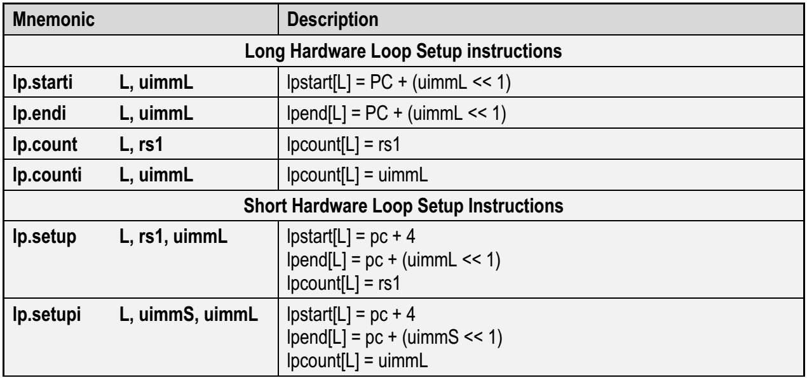
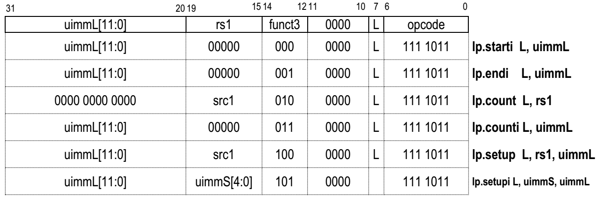
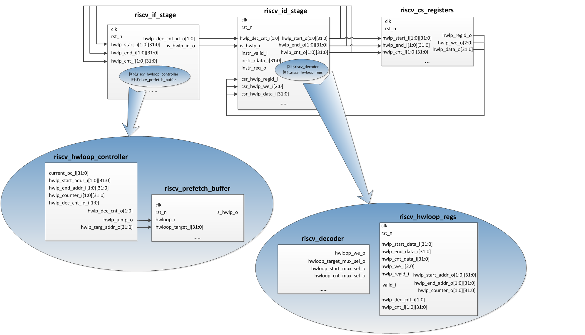

## 8.4 硬件循环机制分析
### 8.4.1 硬件循环介绍
硬件循环是RI5CY引入的一项特殊机制，目的是提高包含有循环操作的代码的执行效率，如下是一段包含有循环操作的C代码。 
~~~c
for(i=0;i<100;i++){
   d[i]=a[i]+1;
}
~~~
如果没有使用硬件循环，其对应的汇编代码如下。 
~~~verilog
  mv x4, 0
  mv x5, 100
Lstart: lw x2, 0(x10)
  addi x10, x10, 4
  addi x2, x2, 1
  sw x2, 0(x11)
  addi x11, x11, 4
  addi x4, x4, 1
  bne x4, x5, Lstart
~~~
寄存器x4存放的是已执行的循环次数，寄存器x5存放的是需要执行的总循环次数，在每一次循环操作最后，要将寄存器x4加1，然后与寄存器x5比较，如果不相等，那么转移到循环起始位置继续执行。这样的一个过程有两个地方影响效率： 
（1）每次循环，要将x4加1。 
（2）每次循环，要做一个分支转移，如果分支预测做的不好，那么会浪费至少一个周期。 
RI5CY引入硬件循环以改进循环效率，引入硬件循环后的汇编代码如下。 
~~~verilog
  lp.setupi 100, Lend
  lw x2, 0(x10)
  addi x10, x10, 4
  addi x2, x2, 1
  sw x2, 0(x11)
Lend: addi x11, x11, 4
~~~
上述代码中涉及到RI5CY定制的硬件循环相关指令，在后续章节中将有介绍，此处，读者只需要理解第一条指令lp.setupi设置了循环次数，设置了循环段的终止地址，随后就是循环段代码，与没有使用硬件循环的汇编代码相比，此处减少了判断是否循环次数达到的代码，同时减少了分支转移指令，效率因此提高。

### 8.4.2 硬件循环相关的CSR
为了实现硬件循环，在RI5CY中定义了一些CSR寄存器，用来保存硬件循环代码段的一些属性，上一节中使用的指令lp.setupi就是用来设置这些寄存器的。每一个硬件循环代码段对应三个CSR，分别保存硬件循环代码段的起始地址、终止地址、循环次数，RI5CY支持嵌套硬件循环，相应的CSR分为两组，对应loop0、loop1，如表8-7所示。  
表8-7 硬件循环相关的CSR 
<table>
<tr>
	<td>地址</td>
	<td>名称</td>
	<td>访问属性</td>
	<td>描述</td>
</tr>
<tr>
	<td>0x7B0</td>
	<td>lpstart[0]</td>
	<td>可读可写</td>
	<td>硬件loop0的起始地址</td>
</tr>
<tr>
	<td>0x7B1</td>
	<td>lpendt[0]</td>
	<td>可读可写</td>
	<td>硬件loop0的终止地址</td>
</tr>
<tr>
	<td>0x7B2</td>
	<td>lpcount[0]</td>
	<td>可读可写</td>
	<td>硬件loop0的循环次数</td>
</tr>
<tr>
	<td>0x7B4</td>
	<td>lpstart[1]</td>
	<td>可读可写</td>
	<td>硬件loop1的起始地址</td>
</tr>
<tr>
	<td>0x7B5</td>
	<td>lpend[1]</td>
	<td>可读可写</td>
	<td>硬件loop1的终止地址</td>
</tr>
<tr>
	<td>0x7B6</td>
	<td>lpcount[1]</td>
	<td>可读可写</td>
	<td>硬件loop1的循环次数</td>
</tr>
</table>

### 8.4.3 硬件循环相关的指令
除了8.4.1节中用到的指令lp.setupi外，还有很多指令用来设置硬件循环，这些指令可以分两类，一类是长指令，一类是短指令，其区别如下。 
* 长指令：每条指令只能设置硬件循环属性中的一条，比如只能设置硬件循环起始地址，但是该类指令不需要紧跟着硬件循环代码段。
* 短指令：每条指令可以设置硬件循环的全部属性，包括硬件循环的起始地址、终止地址、循环次数等，但是该类指令需要紧跟着就是硬件循环代码段。 
硬件循环相关指令如表8-8所示，其编码如图8-14所示。  
表8-8 硬件循环相关指令[6] 
 

 
图8-14 硬件循环相关指令的编码[6] 

### 8.4.4 硬件循环实现过程
RI5CY中与硬件循环实现有关的模块，如图8-15所示，包括如下： 
* 流水线取指阶段模块riscv_if_stage，其中例化了riscv_hwloop_controller、riscv_prefetch_buffer两个与硬件循环实现有关的模块
* 流水线译码阶段模块riscv_id_stage，其中例化了riscv_decoder、riscv_hwloop_regs两个与硬件循环实现有关的模块
* 控制与状态寄存器模块rscv_sc_registers
 
图8-15 RI5CY中与硬件循环实现有关的模块  
图8-15中对部分模块只给出了与硬件循环实现有关的输入输出接口，并简单绘制了其接口连接关系。下面结合图8-15，以及硬件循环指令执行过程，分析硬件循环实现原理。  
硬件循环相关指令在进入流水线的译码阶段时，才被识别出来，具体是在riscv_decoder模块中，相关代码如下，其中instr_rdata_i是从取指阶段传递过来的指令，OPCODE_HWLOOP是一个宏定义，其值是7'h7b，参考图8-14可知，正是硬件循环指令的opcode。随后，依据指令第12-14bit的值，进一步判断是哪一条硬件循环指令，并给出输出信号hwloop_we_o，以及一些复用选择信号的值，其中hwloop_we_o共有3bit，第0bit表示是否是设置循环段起始地址，第1bit表示是否是设置循环段结束地址，第2bit表示是否是设置循环次数。 
~~~verilog
module riscv_decoder
(
  ......

  // from IF/ID pipeline
  input  logic [31:0] instr_rdata_i,           // instruction read from instr memory/cache

  output logic [2:0]  hwloop_we_o,             // write enable for hwloop regs
  output logic        hwloop_target_mux_sel_o, // selects immediate for hwloop target
  output logic        hwloop_start_mux_sel_o,  // selects hwloop start address input
  output logic        hwloop_cnt_mux_sel_o,    // selects hwloop counter input
  ......
);
  always_comb
  begin
    ......

    hwloop_we                   = 3'b0;
    hwloop_target_mux_sel_o     = 1'b0;
    hwloop_start_mux_sel_o      = 1'b0;
    hwloop_cnt_mux_sel_o        = 1'b0;

    .......

    unique case (instr_rdata_i[6:0])
      OPCODE_HWLOOP: begin
        hwloop_target_mux_sel_o = 1'b0;

        unique case (instr_rdata_i[14:12])
          3'b000: begin
            // 是lp.starti指令:设置循环段起始地址
            hwloop_we[0]           = 1'b1;
            hwloop_start_mux_sel_o = 1'b0;
          end

          3'b001: begin
            // 是lp.endi指令:设置循环段结束地址
            hwloop_we[1]         = 1'b1;
          end

          3'b010: begin
            // 是lp.count指令:设置循环次数，其值就在读出的寄存器rega中
            hwloop_we[2]         = 1'b1;
            hwloop_cnt_mux_sel_o = 1'b1;
            rega_used_o          = 1'b1;
          end

          3'b011: begin
            // 是lp.counti指令:设置循环次数，其值是指令中立即数的值
            hwloop_we[2]         = 1'b1;
            hwloop_cnt_mux_sel_o = 1'b0;
          end

          3'b100: begin
            // 是lp.setup指令:需要设置循环段起始地址、结束地址、循环次数，其中循环次数读出的寄存器rega的值
            hwloop_we              = 3'b111;
            hwloop_start_mux_sel_o = 1'b1;
            hwloop_cnt_mux_sel_o   = 1'b1;
            rega_used_o            = 1'b1;
          end

          3'b101: begin
            // 是lp.setupi指令:需要设置循环段起始地址、结束地址、循环次数，其中循环次数是指令中立即数的值
            hwloop_we               = 3'b111;
            hwloop_target_mux_sel_o = 1'b1;
            hwloop_start_mux_sel_o  = 1'b1;
            hwloop_cnt_mux_sel_o    = 1'b0;
          end

          default: begin
            illegal_insn_o = 1'b1;
          end
        endcase
      End
......
  assign hwloop_we_o       = (deassert_we_i) ? 3'b0          : hwloop_we;
~~~
上述信号送入流水线译码阶段，进一步处理，代码如下，其中最终确定了要写的硬件循环相关寄存器的情况。 
~~~verilog
  // 硬件循环有两组寄存器，指令的第7bit表示是要操作哪一组寄存器
  assign hwloop_regid_int = instr[7];   

  // hwloop target mux
  always_comb
  begin
    case (hwloop_target_mux_sel)
      1'b0: hwloop_target = pc_id_i + {imm_iz_type[30:0], 1'b0};
      1'b1: hwloop_target = pc_id_i + {imm_z_type[30:0], 1'b0};
    endcase
  end

  // 硬件循环起始地址的两种情况，一种是当前指令地址加一个立即数的值，另一种是下一条指令地址的值
  always_comb
  begin
    case (hwloop_start_mux_sel)
      1'b0: hwloop_start_int = hwloop_target;   // for PC + I imm
      1'b1: hwloop_start_int = pc_if_i;         // for next PC
    endcase
  end

  // 硬件循环次数的两种情况，一种是立即数，另一种是读出的寄存器的值
  always_comb
  begin : hwloop_cnt_mux
    case (hwloop_cnt_mux_sel)
      1'b0: hwloop_cnt_int = imm_iz_type;
      1'b1: hwloop_cnt_int = operand_a_fw_id;
    endcase;
  end

  // 最终确定要写的硬件循环相关寄存器的情况
  assign hwloop_start = hwloop_we_int[0] ? hwloop_start_int : csr_hwlp_data_i;
  assign hwloop_end   = hwloop_we_int[1] ? hwloop_target    : csr_hwlp_data_i;
  assign hwloop_cnt   = hwloop_we_int[2] ? hwloop_cnt_int   : csr_hwlp_data_i;
  assign hwloop_regid = (|hwloop_we_int) ? hwloop_regid_int : csr_hwlp_regid_i;
  assign hwloop_we    = (|hwloop_we_int) ? hwloop_we_int    : csr_hwlp_we_i;
~~~
参考图8-15可知，上述代码确定的信号，会送入到riscv_hwloop_regs模块对应端口，做进一步处理。riscv_hwloop_regs模块实际实现了两组硬件循环相关寄存器，所以上述信号，会修改这些硬件循环相关寄存器的值，代码如下。 
~~~verilog
module riscv_hwloop_regs
#(
  parameter N_REGS     = 2,
  parameter N_REG_BITS = $clog2(N_REGS)
)
(
  input  logic                     clk,
  input  logic                     rst_n,

  // from ex stage
  input  logic           [31:0]    hwlp_start_data_i,
  input  logic           [31:0]    hwlp_end_data_i,
  input  logic           [31:0]    hwlp_cnt_data_i,
  input  logic            [2:0]    hwlp_we_i,
  input  logic [N_REG_BITS-1:0]    hwlp_regid_i,         // selects the register set

  // from controller
  input  logic                     valid_i,

  // from hwloop controller
  input  logic [N_REGS-1:0]        hwlp_dec_cnt_i,

  // to hwloop controller
  output logic [N_REGS-1:0] [31:0] hwlp_start_addr_o,
  output logic [N_REGS-1:0] [31:0] hwlp_end_addr_o,
  output logic [N_REGS-1:0] [31:0] hwlp_counter_o
);

  logic [N_REGS-1:0] [31:0] hwlp_start_q;
  logic [N_REGS-1:0] [31:0] hwlp_end_q;
  logic [N_REGS-1:0] [31:0] hwlp_counter_q, hwlp_counter_n;

  int unsigned i;

  assign hwlp_start_addr_o = hwlp_start_q;
  assign hwlp_end_addr_o   = hwlp_end_q;
  assign hwlp_counter_o    = hwlp_counter_q;

  // 设置硬件循环的起始地址
  always_ff @(posedge clk, negedge rst_n)
  begin : HWLOOP_REGS_START
    if (rst_n == 1'b0)
    begin
      hwlp_start_q <= '{default: 32'b0};
    end
    else if (hwlp_we_i[0] == 1'b1)
    begin
      hwlp_start_q[hwlp_regid_i] <= hwlp_start_data_i;
    end
  end

// 设置硬件循环的结束地址
  always_ff @(posedge clk, negedge rst_n)
  begin : HWLOOP_REGS_END
    if (rst_n == 1'b0)
    begin
      hwlp_end_q <= '{default: 32'b0};
    end
    else if (hwlp_we_i[1] == 1'b1)
    begin
      hwlp_end_q[hwlp_regid_i] <= hwlp_end_data_i;
    end
  end

 // 设置硬件循环的执行次数，并且在每次执行一遍后，将执行次数减一
  genvar k;
  for (k = 0; k < N_REGS; k++) begin
    assign hwlp_counter_n[k] = hwlp_counter_q[k] - 1;
  end

  always_ff @(posedge clk, negedge rst_n)
  begin : HWLOOP_REGS_COUNTER
    if (rst_n == 1'b0)
    begin
      hwlp_counter_q <= '{default: 32'b0};
    end
    else
    begin
      for (i = 0; i < N_REGS; i++)
      begin
        if ((hwlp_we_i[2] == 1'b1) && (i == hwlp_regid_i)) begin
          hwlp_counter_q[i] <= hwlp_cnt_data_i;
        end else begin
          if (hwlp_dec_cnt_i[i] && valid_i)
            hwlp_counter_q[i] <= hwlp_counter_n[i];
        end
      end
    end
  end

  // do not decrement more than one counter at once
  assert property (
    @(posedge clk) (valid_i) |-> ($countones(hwlp_dec_cnt_i) <= 1) );

Endmodule
~~~
至此，硬件循环相关寄存器设置完毕，参考图8-15，这些寄存器的值通过接口hwlp_start_o、hwlp_end_o、hwlp_cnt_o送入流水线取指阶段的模块if_stage。后者例化了riscv_hwloop_controller、riscv_prefetch_buffer两个与硬件循环实现有关的模块。  
参考图8-15，hwlp_start_o、hwlp_end_o、hwlp_cnt_o实际是直接送入riscv_hwloop_controller模块，同时送入riscv_hwloop_controller模块的，还有当前正在读取的指令的地址current_pc_i。riscv_hwloop_controller模块判断current_pc_i是否等于hwlp_end_o中的一个值，如果相等，并且对应的hwlp_cnt_o不等于1（实际在代码中跳转的条件比较复杂，笔者也没有看懂为何当hwlp_cnt_o等于2的时候，跳转条件是~hwlp_dec_cnt_id_i[i]），那么就跳转到循环代码的起始地址，主要代码如下： 
~~~verilog
module riscv_hwloop_controller
#(
  parameter N_REGS = 2
)
(
  // from id stage
  input  logic [31:0]              current_pc_i,

  // from hwloop_regs
  input  logic [N_REGS-1:0] [31:0] hwlp_start_addr_i,
  input  logic [N_REGS-1:0] [31:0] hwlp_end_addr_i,
  input  logic [N_REGS-1:0] [31:0] hwlp_counter_i,

  // to hwloop_regs
  output logic [N_REGS-1:0]        hwlp_dec_cnt_o,

  // from pipeline stages
  input  logic [N_REGS-1:0]        hwlp_dec_cnt_id_i,

  // to id stage
  output logic                     hwlp_jump_o,
  output logic [31:0]              hwlp_targ_addr_o
);

  logic [N_REGS-1:0] pc_is_end_addr;

  // end address detection
  integer j;

  // 下面的代码判断当前正在取的指令地址current_pc_i是否等于任一硬件循环段的结束地址
  // 如果当前正在取的指令地址current_pc_i等于任一硬件循环段的结束地址，并且对应的hwlp_cnt_o不等于1
  // 那么设置pc_is_end_addr为1
  genvar i;
  generate
    for (i = 0; i < N_REGS; i++) begin
      always @(*)
      begin
        pc_is_end_addr[i] = 1'b0;
        if (current_pc_i == hwlp_end_addr_i[i]) begin
          if (hwlp_counter_i[i][31:2] != 30'h0) begin
            pc_is_end_addr[i] = 1'b1;
          end else begin
            case (hwlp_counter_i[i][1:0])
              2'b11:        pc_is_end_addr[i] = 1'b1;
              2'b10:        pc_is_end_addr[i] = ~hwlp_dec_cnt_id_i[i]; // only when there is nothing in flight
              2'b01, 2'b00: pc_is_end_addr[i] = 1'b0;
            endcase
          end
        end
      end
    end
  endgenerate

  // 如果pc_is_end_addr是1，那么表示跳转到硬件循环段的起始地址继续执行
  always_comb
  begin
    hwlp_targ_addr_o = 'x;
    hwlp_dec_cnt_o   = '0;

    for (j = 0; j < N_REGS; j++) begin
      if (pc_is_end_addr[j]) begin
        hwlp_targ_addr_o  = hwlp_start_addr_i[j];
        hwlp_dec_cnt_o[j] = 1'b1;
        break;
      end
    end
  end

  // output signal for ID stage
  assign hwlp_jump_o = (|pc_is_end_addr);

Endmodule
~~~
上述代码中的输出信号hwlp_jump_o、hwlp_targ_addr_o送入图8-15中的riscv_prefetch_buffer模块（参考8.3.2节，如果采用的是配置二，即指令预取Buffer等于指令缓存line的大小，比如128位，那么hwlp_jump_o、hwlp_targ_addr_o实际将送入riscv_prefetch_L0_buffer模块），后者将清除其内部FIFO中的内容，然后从硬件循环段起始地址重新取指填充FIFO。 

## 参考文献
[1]PULP - An Open Parallel Ultra-Low-Power Processing-Platform, http://iis-projects.ee.ethz.ch/index.php/PULP,2017-8  
[2]Florian Zaruba, Updates on PULPino, The 5th RISC-V Workshop, 2016. 
[3]Michael Gautschi,etc,Near-Threshold RISC-V Core With DSP Extensions for Scalable IoT Endpoint Devices, IEEE Transactions on Very Large Scale Integration Systems 
[4]Andreas Traber, Michael Gautschi,PULPino: Datasheet,2016.11 
[5]http://www.pulp-platform.org/ 
[6]Andreas Traber,Michael Gautschi,Pasquale Davide Schiavone. RI5CY: User Manual version1.3.  
[7]Andreas Traber, etc. PULPino: A small single-core RISC-V SoC. The 4th RISC-V Workshop, 2016. 