### 8.3 RI5CY介绍
#### 8.3.1 RI5CY的结构
PULPino支持多种处理器核，RI5CY是其中一种，也是其中最早开源的处理器核。RI5CY是一款四级流水线的32位处理器，采用的是risc-v指令集，并进行了扩展，从而实现低能耗执行某些数据处理指令。其支持的指令如下： 
* RV32I
* RV32C
* RV32M
* 扩展指令：
	- 算术指令扩展（ALU Extension）
	- 硬件循环（Hardware Loop）
	- 地址自增的访存指令（post-incrementing Load & Strore Instruciton）
	- 乘累加指令（Multiply-Accumulate）
	- 向量操作（Vectorial）  
RI5CY的结构示意图如图8-10所示。典型的四级流水线结构，大部分模块都很好理解，本节重点对其中的指令预取Buffer（Prefetch Buffer）、加载存储单元（LSU）进行介绍，另外，在8.4节会对硬件循环控制器（hwloop control）进行介绍。 
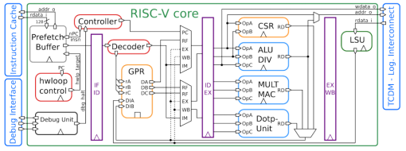 
图8-10 RI5CY的结构示意图[3] 

#### 8.3.2 指令预取Buffer
参考图8-1可以更加清楚的理解指令预取Buffer的作用，指令预取Buffer位于处理器核与共享的指令缓存之间，共享的指令缓存可能会由于多个处理器核同时访问，而增加延迟，为此，为每个处理器设计了一个容量很小的指令预取Buffer，可以在不影响面积的前提下提高性能。除此之外，还有一个理由，RI5CY支持RV32C，即指令可能是16位的，此时取指的地址可能不是4字节对齐，这种非对齐访问，至少需要两个时钟周期才能取得指令，通过增加指令预取Buffer，能够实现一个时钟周期取得指令。  
指令预取Buffer的大小可以有两种配置： 
配置一：可以存放3条32位指令，按照FIFO原则使用 
配置二：是指令缓存line的大小，比如128位。  
需要注意一点，对于配置二而言，实际大小并不是128位，而是128+32位，这主要是考虑到有些指令会跨两条指令缓存line。如图8-11所示。在指令缓存中，上一条line的最后32bit的低16bit是一个16位的压缩指令，所以在取下一条指令缓存line的时候，需要暂时保存上一条line的最后32位，其中的高16bit与下一条指令缓存line的低16bit组成一条完整的指令。这也解释了为何通过添加指令预取Buffer可以实现即使指令地址不是4字节对齐的，也可以在一个时钟周期取得指令的原因。  
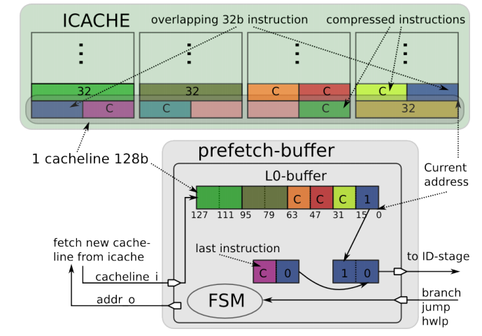 
图8-11 指令跨两条指令缓存line的情况 

#### 8.3.3 加载存储单元
加载存储单元（LSU：Load-Store-Unit）是RI5CY与数据存储器的桥梁，访问的粒度可以是字、半字、字节。并且支持地址非对齐访问，其原理是访问两个连续的对齐地址对应的字，然后拼接成指定的数据，所以对非对齐访问，需要至少两个时钟周期。LSU与数据存储器的接口信号如表8-3所示。  
表8-2 LSU的接口信号表 
<table>
<tr>
	<td>接口名称</td>
	<td>方向</td>
	<td>描述</td>
</tr>
<tr>
	<td>data_req_o</td>
	<td>输出</td>
	<td>请求有效信号，在一次访问中，该信号保持为1，直到输入信号data_gnt_i持续一个时钟周期为1，此时表示本次访问结束</td>
</tr>
<tr>
	<td>data_addr_o[31:0]</td>
	<td>输出</td>
	<td>访问地址</td>
</tr>
<tr>
	<td>data_we_o</td>
	<td>输出</td>
	<td>为1，表示是写操作，反之，表示是读操作</td>
</tr>
<tr>
	<td>data_be_o[3:0]</td>
	<td>输出</td>
	<td>以字节为粒度的使能标志，每一bit对应一个字节</td>
</tr>
<tr>
	<td>data_wdata_o[31:0]</td>
	<td>输出</td>
	<td>要写的数据</td>
</tr>
<tr>
	<td>data_rdata_i[31:0]</td>
	<td>输入</td>
	<td>从数据存储器返回的数据</td>
</tr>
<tr>
	<td>data_rvalid_i</td>
	<td>输入</td>
	<td>为1，表示数据访问请求处理完毕</td>
</tr>
<tr>
	<td>data_gnt_i</td>
	<td>输入</td>
	<td>为1，表示数据存储器一侧接收了本次访问请求，此时，不一定给出访问结果，但是LSU侧可以继续访问下一个地址</td>
</tr>
</table>

LSU访问时序十分简单，首先设置data_req_o为1，设置data_addr_o为目标地址，同时设置data_we_o、data_be_o、data_wdata_o等信号，数据存储器收到该访问请求后，如果能够处理，那么设置data_gnt_i为高，表示确认。访问请求处理完毕后，设置data_rvalid_i为1，如果是读请求，此时data_rdata_i就是返回的数据。如图8-12、8-13、8-14所示。其中图8-12是正常的访问过程。图8-13是背对背访问过程，当data_gnt_i为高后，不等到返回结果，立即设置data_addr_o、data_wdata_o、data_be_o、data_we_o为下次访问的值，从而提高访问效率。图8-14是延迟响应的访问过程，数据存储器确认访问请求后（即data_gnt_i为高），等待一段时间，才返回有效数据。  
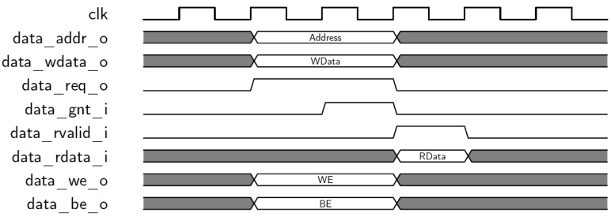 
图8-12 基本的LSU访问时序 

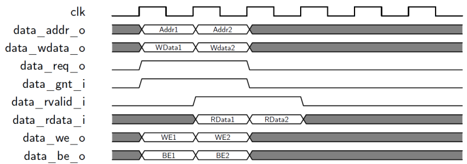 
图8-13 背对背的LSU访问时序 

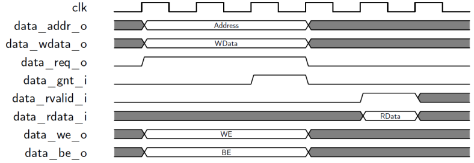 
图8-14 延迟响应的LSU访问时序 

#### 8.3.4 控制与状态寄存器
RI5CY并没有实现RISC-V privileged specification中定义的所有控制与状态寄存器（CSR：Control and Status Register），只实现了需要的一些CSR，如表8-4所示。大体可以分为四类：
* 处理器属性寄存器：MCPUID、MIMPID、MHARTID，这些都是只读寄存器。
* 异常相关寄存器：MSTATUS、MEPC、MCAUSE、MESTATUS。
* 性能计数相关寄存器：PCCRs、PCER、PCMR。
* 硬件循环相关寄存器：HWLP
除了HWLP外，其余寄存器在RISC-V privileged specification中均有说明，此处不再赘述，HWLP将在8.4节介绍硬件循环的时候一并介绍。  
表8-4 RI5CY实现的CSR 
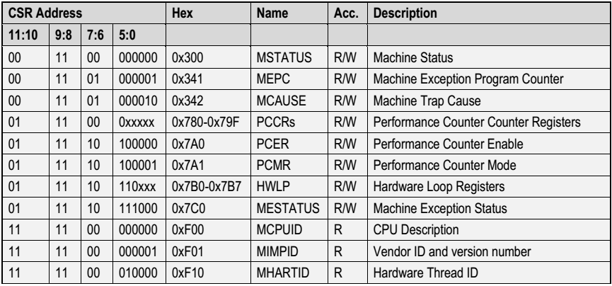 

#### 8.3.5 接口描述
可以从https://github.com/pulp-platform/riscv 下载RI5CY的源码，其顶层模块位于riscv_core.sv，依据该模块，得到RI5CY的接口示意图如图8-15所示。对于大多数接口都可以通过接口名称最后的_i还是_o区分出是输入接口还是输出接口。 
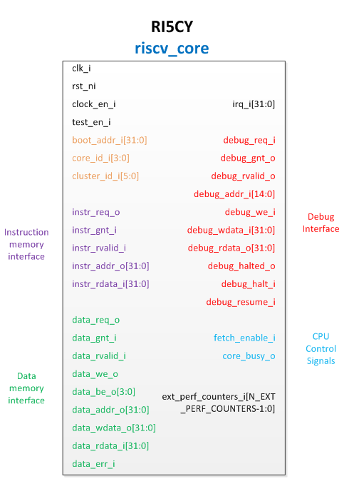 
图8-15RI5CY的接口示意图 

从图8-15可以发现，RI5CY的接口主要包括：指令存储器接口、数据存储器接口、调试接口、中断输入、控制信号输入，以及一些全局信号输入。此处仅对boot_addr_i接口作进一步解释，该信号来自PULPino中的SoC Controller模块（参考图8-3，源代码位于https://github.com/pulp-platform/apb_pulpino ），后者内部有一个寄存器Boot Address，该寄存器定义了系统运行的起始地址，该寄存器的值通过boot_addr_i接口传入RI5CY，RI5CY的if_stage.sv中的如下代码，给出第一条指令的地址。
~~~verilog
  // fetch address selection
  always_comb
  begin
    fetch_addr_n = 'x;

    unique case (pc_mux_i)
      PC_BOOT:      fetch_addr_n = {boot_addr_i[31:8], EXC_OFF_RST};
      PC_JUMP:      fetch_addr_n = jump_target_id_i;
      PC_BRANCH:    fetch_addr_n = jump_target_ex_i;
      PC_EXCEPTION: fetch_addr_n = exc_pc;             // set PC to exception handler
      PC_ERET:      fetch_addr_n = exception_pc_reg_i; // PC is restored when returning from IRQ/exception
      PC_DBG_NPC:   fetch_addr_n = dbg_jump_addr_i;    // PC is taken from debug unit

      default:;
    endcase
  End
~~~
从代码可知，起始地址实际是将boot_addr_i的最后一个字节替换为复位异常处理例程的入口地址EXC_OFF_RST得到的，比如：默认的boot_addr_i是0x00008000，从图8-9可知复位异常处理例程的入口地址为0x80，所以系统默认的第一条指令地址是0x00008080。

#### 8.3.6 性能分析
在参考文献[7]中对RI5CY的性能，与ARM Cortex-M4进行了对比分析，主要是从两个方面进行分析，首先是从面积、功耗方面比较，如图8-16所示，从中可以发现RI5CY在面积、功耗方面均优于ARM Cortex-M4.  
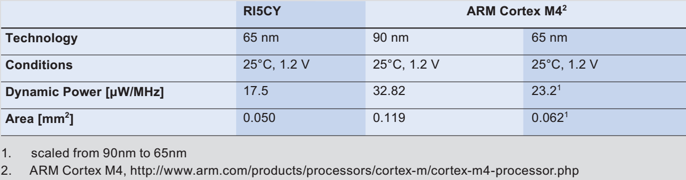 
图8-16 RI5CY与ARM Cortex-M4的面积、功耗对比  
其次是从运算速度上进行了比较，如图8-17所示，对五种处理器的运算速度进行了对比，这五种处理器分别是：ARM Cortex-M4、没有实现扩展指令的OR10N、没有实现扩展指令的RI5CY、实现扩展指令的OR10N、实现扩展指令的RI5CY。此处的扩展指令指的就是在8.3.1节中列出的硬件循环指令、算数扩展指令、向量操作指令等。从图8-17可以发现实现了扩展指令的OR10N、RI5CY明显优于没有实现扩展指令的OR10N、RI5CY，并且优于ARM Cortex_m4。  
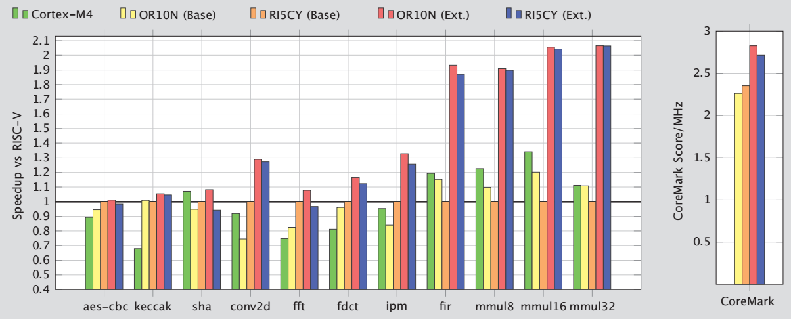 
图8-17 RI5CY的运算速度比较 

#### 8.3.7 代码介绍
RI5CY的代码也是采用System Verilog写的，从https://github.com/pulp-platform/riscv 下载得到代码，可以发现RI5CY的代码结构很简单，也很模块化，主要文件及其作用如表8-5所示。 

表8-5 RI5CY源代码中主要文件及其作用 
<table>
<tr>
	<td>文件名</td>
	<td>作用</td>
</tr>
<tr>
	<td>alu.sv</td>
	<td>算术逻辑运算单元，实现了大部分算术逻辑运算</td>
</tr>
<tr>
	<td>alu_div.sv</td>
	<td>实现了除法运算</td>
</tr>
<tr>
	<td>compressed_decoder.sv</td>
	<td>将16bit的压缩指令扩展为等价的32bit指令</td>
</tr>
<tr>
	<td>controller.sv</td>
	<td>实现了流水线的控制通路</td>
</tr>
<tr>
	<td>cs_registers.sv</td>
	<td>实现了CSR</td>
</tr>
<tr>
	<td>debug_unit.sv</td>
	<td>调试单元</td>
</tr>
<tr>
	<td>decoder.sv</td>
	<td>实现对指令的译码</td>
</tr>
<tr>
	<td>ex_stage.sv</td>
	<td>对应流水线的执行阶段</td>
</tr>
<tr>
	<td>exc_controller.sv</td>
	<td>异常控制器</td>
</tr>
<tr>
	<td>hwloop_controller.sv</td>
	<td>硬件循环控制器</td>
</tr>
<tr>
	<td>hwloop_regs.sv</td>
	<td>硬件循环对应的寄存器</td>
</tr>
<tr>
	<td>id_stage.sv</td>
	<td>对应流水线的译码阶段</td>
</tr>
<tr>
	<td>if_stage.sv</td>
	<td>对应流水线的取指阶段</td>
</tr>
<tr>
	<td>load_store_unit.sv</td>
	<td>实现了对数据存储器的访问</td>
</tr>
<tr>
	<td>mult.sv</td>
	<td>实现了整数乘法、点积运算</td>
</tr>
<tr>
	<td>prefetch_buffer.sv</td>
	<td>实现了指令预取单元，并且是配置一：可以存放3条32位指令，按照FIFO原则使用</td>
</tr>
<tr>
	<td>prefetch_L0_buffer.sv</td>
	<td>实现了指令预取单元，并且是配置二：大小等于指令缓存line，即128位</td>
</tr>
<tr>
	<td>register_file.sv</td>
	<td>实现了寄存器文件，32个32位寄存器，具有3个读端口，2个写端口，并且采用的锁存器实现的，目标是针对ASIC应用</td>
</tr>
<tr>
	<td>register_file_ff.sv</td>
	<td>也实现了寄存器文件，32个32位寄存器，具有3个读端口，2个写端口，但是采用的触发器实现的，目标是针对FPGA应用</td>
</tr>
<tr>
	<td>riscv_core.sv</td>
	<td>RI5CY的顶层模块</td>
</tr>
<tr>
	<td>riscv_simchecker.sv</td>
	<td>仿真过程检验</td>
</tr>
<tr>
	<td>riscv_tracer.sv</td>
	<td>记录执行过的指令</td>
</tr>
</table>

#### 8.3.8 启动过程分析
在8.3.5节中，分析出系统的默认启动地址是0x00008080，参考图8-8可知，该地址位于Boot ROM中，Boot ROM的源代码位于PULPino源代码的rtl\boot_code.sv中，该文件很好理解，主体就是一个ROM，采用数组实现，数组的每个元素都是32bit，如下： 
~~~verilog
module boot_code
(
    input  logic        CLK,
    input  logic        RSTN,

    input  logic        CSN,
    input  logic [9:0]  A,
    output logic [31:0] Q
  );

  const logic [0:547] [31:0] mem = {
    32'h00000013,
......
    32'h00000000,
    32'h00000000};

  logic [9:0] A_Q;

  always_ff @(posedge CLK)
  begin
    if (~RSTN)
      A_Q <= '0;
    else
      if (~CSN)
        A_Q <= A;
  end

  assign Q = mem[A_Q];

Endmodule
~~~

PULPino提供了一种简单地方法得到boot_code.sv只需输入以下命令即可： 
`
make boot_code.install
`
 
实际过程是，编译sw\ref目录下的crt0.boot.S，与sw\apps\boot_code目录下的boot_code.c然后使用sw\ref目录下的link.boot.ld文件进行链接，最后使用sw\utils目录下的s19toboot.py将目标文件转化为boot_code.sv。具体过程如图8-18所示。  
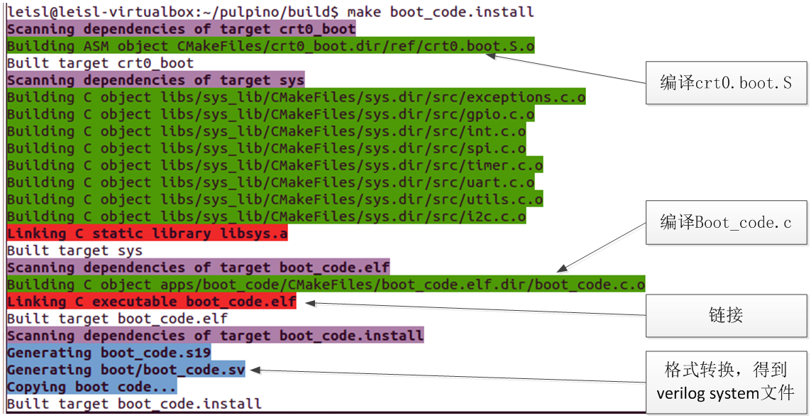 
图8-18 得到启动文件的过程 

所以默认的启动过程实际就是由crt0.boot.S、boot_code.c决定的，需要分析这两个文件。首先分析crt0.boot.S，该文件十分简单，从地址0开始定义中断处理例程，如下： 
~~~verilog
  .org 0x00
  .rept 31
  nop
  .endr
  jal x0, default_exc_handler

  // reset vector
  .org 0x80
  jal x0, reset_handler

  // illegal instruction exception
  .org 0x84
  jal x0, default_exc_handler

  // ecall handler
  .org 0x88
  jal x0, default_exc_handler
~~~
其中0x80处的复位异常处理例程是跳转到reset_handler，所以系统复位后会转移到reset_handler执行，后者的定义如下： 
~~~verilog
reset_handler:
  /* set all registers to zero */
  mv  x1, x0
  mv  x2, x1
  mv  x3, x1
  mv  x4, x1
  mv  x5, x1
  mv  x6, x1
  mv  x7, x1
  mv  x8, x1
  mv  x9, x1
  mv x10, x1
  mv x11, x1
  mv x12, x1
  mv x13, x1
  mv x14, x1
  mv x15, x1
  mv x16, x1
  mv x17, x1
  mv x18, x1
  mv x19, x1
  mv x20, x1
  mv x21, x1
  mv x22, x1
  mv x23, x1
  mv x24, x1
  mv x25, x1
  mv x26, x1
  mv x27, x1
  mv x28, x1
  mv x29, x1
  mv x30, x1
  mv x31, x1

  /* stack initilization */
  la   x2, _stack_start

_start:
  .global _start

  /* clear BSS */
  la x26, _bss_start
  la x27, _bss_end

  bge x26, x27, zero_loop_end

zero_loop:
  sw x0, 0(x26)
  addi x26, x26, 4
  ble x26, x27, zero_loop
zero_loop_end:

main_entry:
  /* jump to main program entry point (argc = argv = 0) */
  addi x10, x0, 0
  addi x11, x0, 0
  jal x1, main
~~~

依次做了这几件事： 
* 初始化寄存器，全部初始化为0
* 初始化堆栈，全部初始化为0
* 跳转到main函数执行
于是就从crt0.boot.S转移到boot_code.c继续执行。后者从SPI flash中加载程序到指令RAM、数据RAM，然后继续执行。存放在SPI flash中的程序格式如图8-19所示。  
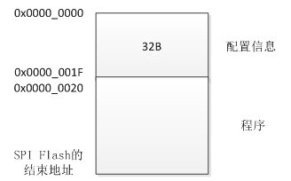 
图8-19 存放在SPI flash中的程序格式 

其中前32个字节是配置信息，后面数据段、程序段。配置信息的32个字节是8个字，含义如表8-6所示。  
表8-6 SPI Flash中前32字节配置信息的含义 
<table>
<tr>
	<td>序号</td>
	<td>含义</td>
</tr>
<tr>
	<td>字0</td>
	<td>代码段在Flash中的偏移地址</td>
</tr>
<tr>
	<td>字1</td>
	<td>程序运行时，代码段在PULPino的起始地址，参考图8-8，可知是0x0</td>
</tr>
<tr>
	<td>字2</td>
	<td>代码段字节数</td>
</tr>
<tr>
	<td>字3</td>
	<td>代码段占用的页面数，每页默认为4KB</td>
</tr>
<tr>
	<td>字4</td>
	<td>数据段在Flash中的偏移地址，默认是0x20</td>
</tr>
<tr>
	<td>字5</td>
	<td>程序运行时，数据段在PULPino的起始地址，参考图8-8，可知是0x00010000</td>
</tr>
<tr>
	<td>字6</td>
	<td>数据段字节数</td>
</tr>
<tr>
	<td>字7</td>
	<td>数据段占用的页面数，每页默认为4KB</td>
</tr>
</table>

Boot_code按照这里的配置信息，将数据、代码分别加载到指定的位置，然后转移到代码段开始执行用户程序。

### 参考文献
[1]PULP - An Open Parallel Ultra-Low-Power Processing-Platform, http://iis-projects.ee.ethz.ch/index.php/PULP,2017-8  
[2]Florian Zaruba, Updates on PULPino, The 5th RISC-V Workshop, 2016. 
[3]Michael Gautschi,etc,Near-Threshold RISC-V Core With DSP Extensions for Scalable IoT Endpoint Devices, IEEE Transactions on Very Large Scale Integration Systems 
[4]Andreas Traber, Michael Gautschi,PULPino: Datasheet,2016.11 
[5]http://www.pulp-platform.org/ 
[6]Andreas Traber,Michael Gautschi,Pasquale Davide Schiavone. RI5CY: User Manual version1.3.  
[7]Andreas Traber, etc. PULPino: A small single-core RISC-V SoC. The 4th RISC-V Workshop, 2016. 